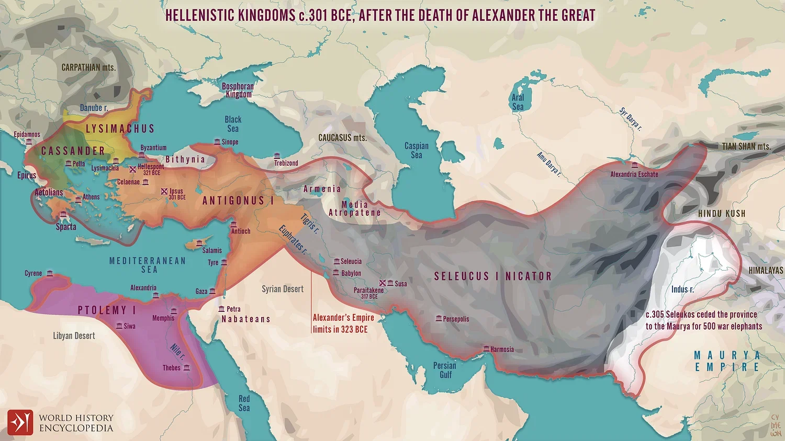
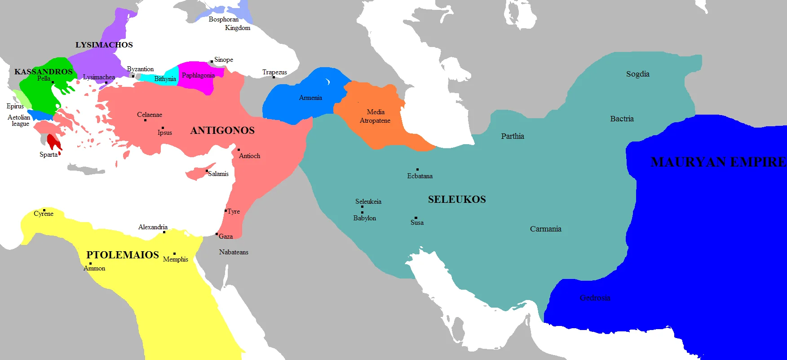
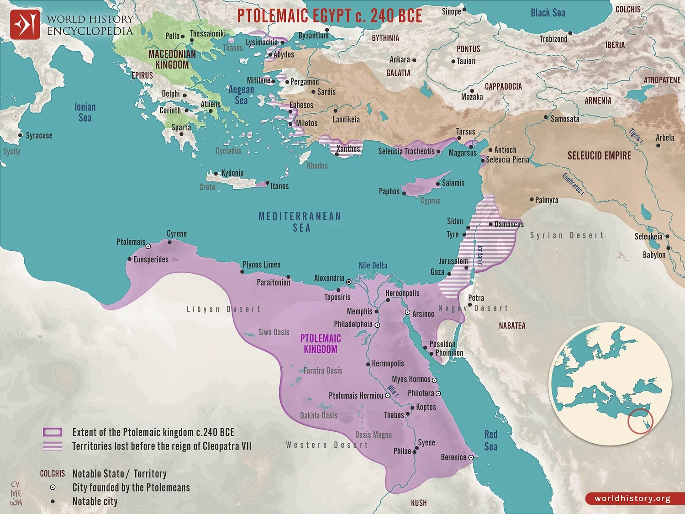

## 1. 페르시아 시대 (주전 539-333년)

구약성경의 마지막 부분인 에스라, 느헤미야, 에스더서 및 말라기가 이 시기에 기록되었습니다.

- **주전 539년**: 페르시아의 고레스 왕이 바벨론을 정복하고 유대인들의 귀환을 허락
- **주전 516년**: 예루살렘 성전 재건축 완료
- **주전 458년**: 에스라의 귀환
- **주전 445년**: 느헤미야의 귀환과 예루살렘 성벽 재건
- **주전 433년**: 말라기 선지자의 활동 (구약의 마지막 선지자)

## 2. 헬라 시대 (주전 333-63년)

### 알렉산더 대왕과 그의 후계자들 (주전 333-323년)

- **주전 333년**: 알렉산더 대왕이 페르시아를 정복
- **주전 332년**: 알렉산더가 유대를 정복하지만 유대인들의 종교적 자유를 허락
- **주전 323년**: 알렉산더 대왕 사망 후 제국이 네 장군에 의해 분할

> ⚠️ 알렉산더 대왕이 주전 323년 사망한 후, 그의 제국은 네 명의 장군(디아도코이)에 의해 분할되었습니다. 일반적으로 다음과 같이 분할되었습니다:
>
> - 카산드로스: 마케도니아와 그리스
> - 리시마코스: 트라키아와 소아시아 북서부
> - 셀레우코스: 시리아, 바빌로니아, 페르시아 등 동방 지역
> - 프톨레마이오스(톨레미): 이집트와 팔레스타인(유대) 지역
>
> 특히 셀류쿠스 왕조와 톨레미 왕조는 이후 유대 역사에 중요한 영향을 미쳤습니다.

### 톨레미 왕조 (주전 323-198년)

- **주전 320-198년**: 이집트의 톨레미 왕조가 유대 지배

- **주전 285-247년**: 히브리 성경의 그리스어 번역(70인역) 시작

### 셀류쿠스 왕조와 마카비 혁명 (주전 198-63년)

- **주전 198년**: 시리아의 셀류쿠스 왕조가 유대 지배권 획득
- **주전 175-164년**: 안티오쿠스 4세 에피파네스의 박해
- **주전 167년**: 마카비 혁명 시작
- **주전 164년**: 성전 정화와 재봉헌 (하누카 축제의 기원)
- **주전 142-63년**: 하스모니안 왕조의 독립 유대 국가

## 3. 로마 시대 (주전 63년-)

### 로마의 유대 점령

- **주전 63년**: 폼페이우스 장군이 예루살렘을 정복하고 로마의 지배 시작
- **주전 40-4년**: 헤롯 대왕의 통치 (로마의 지원을 받는 이두메아인 왕)
- **주전 19년**: 헤롯 성전 재건 시작
- **주전 4년경**: 예수 그리스도 탄생

### 신약시대의 로마 통치

- **주전 4년-주후 6년**: 헤롯 아켈라오의 통치
- **주전 4년-주후 39년**: 헤롯 안티파스의 갈릴리 통치 (세례 요한을 처형한 인물)
- **주후 6-41년**: 유대가 로마의 직접 통치 아래 놓임 (총독 시대)
- **주후 26-36년**: 본디오 빌라도의 유대 총독 재임 (예수 재판과 십자가 처형)
- **주후 30년경**: 예수 그리스도의 십자가 처형과 부활
- **주후 37-44년**: 헤롯 아그립바 1세의 통치 (초대교회 박해)
- **주후 44-66년**: 로마 총독 통치 재개
- **주후 48-58년**: 바울의 선교 여행
- **주후 66-70년**: 제1차 유대-로마 전쟁
- **주후 70년**: 예루살렘과 성전 파괴

## 4. 신약시대의 종교적 분파

이러한 정치적 배경 속에서 다양한 종교적 분파가 형성되었습니다.

### 주요 유대교 분파

- **바리새파**: 율법에 엄격하며 구전 율법(미쉬나)을 중시, 부활과 천사의 존재를 믿음
- **사두개파**: 귀족과 제사장 계층, 오직 모세오경만 권위로 인정, 부활과 내세를 부정
- **에세네파**: 쿰란 공동체를 형성한 분리주의자들, 금욕주의와 종말론 강조
- **열심당**: 로마에 대항한 무장 저항 단체, 정치적 독립을 강조
- **헤롯당**: 헤롯 왕가를 지지하며 로마와의 타협을 통한 유대의 번영 추구

### 신약시대의 중요 사건들

- **유대인 디아스포라**: 로마 제국 전역에 유대인 공동체 형성
- **헬라화의 영향**: 코이네 그리스어의 보편화로 신약성경이 그리스어로 기록됨
- **로마 시민권**: 바울과 같은 일부 유대인들이 로마 시민권을 가짐
- **팍스 로마나(Pax Romana)**: 로마의 평화 시대로 초기 기독교 확산에 기여

## 5. 참고 자료

- 구약과 신약 사이의 400년(신구약 중간사)은 성경에 직접 기록되지 않았으나, 마카비서와 같은 외경과 요세푸스의 저술에서 정보를 얻을 수 있습니다.
- 헬라화의 영향으로 유대인들 사이에 전통을 지키려는 보수파와 헬라 문화를 수용하려는 진보파 간의 갈등이 있었습니다.
- 초대 교회는 이러한 복잡한 정치적, 종교적 배경 속에서 탄생하여 발전했습니다.
