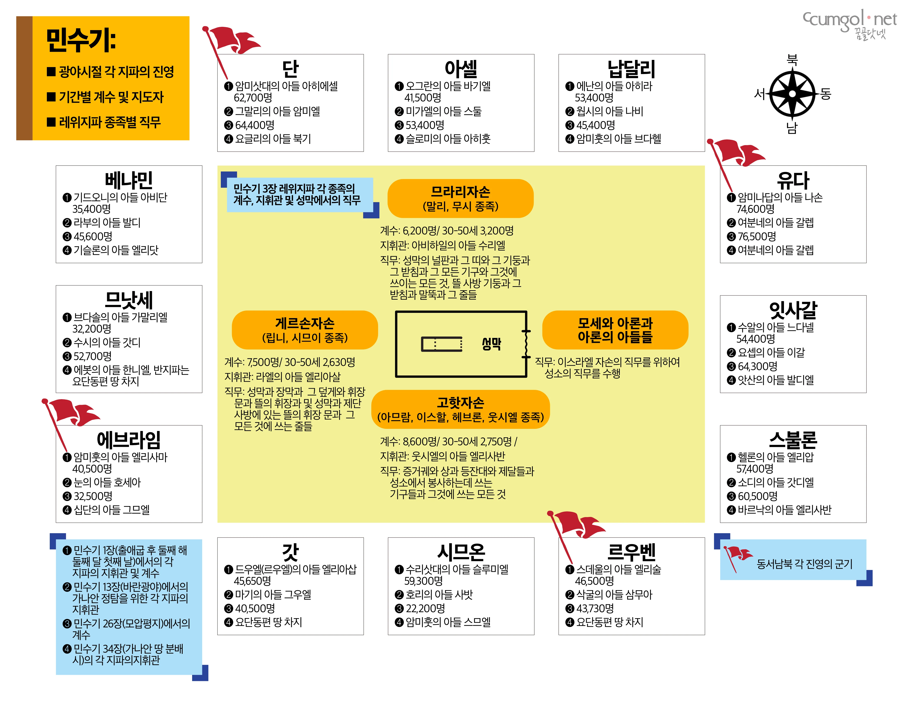

광야에서 이스라엘 백성은 시내산과 모압평지 두 곳에서 계수를 했습니다. 각 지파 지휘관의 이름은 시내산, 바란광야에서 가나안 땅을 탐지하기 위해, 그리고 가나안 땅 분배 시에 나옵니다. 이스라엘이 광야에서 유숙할 때와 행진할 때 군대의 진영을 갖추고 있는 것을 알 수 있으며, 레위지파 자손들도 각각의 직무를 배정받고 성막을 중심으로 지정된 진영에서 유숙했습니다.

